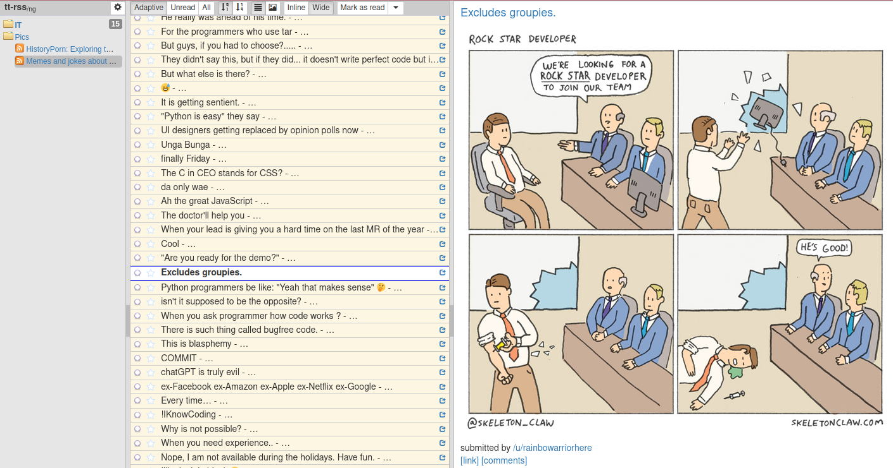
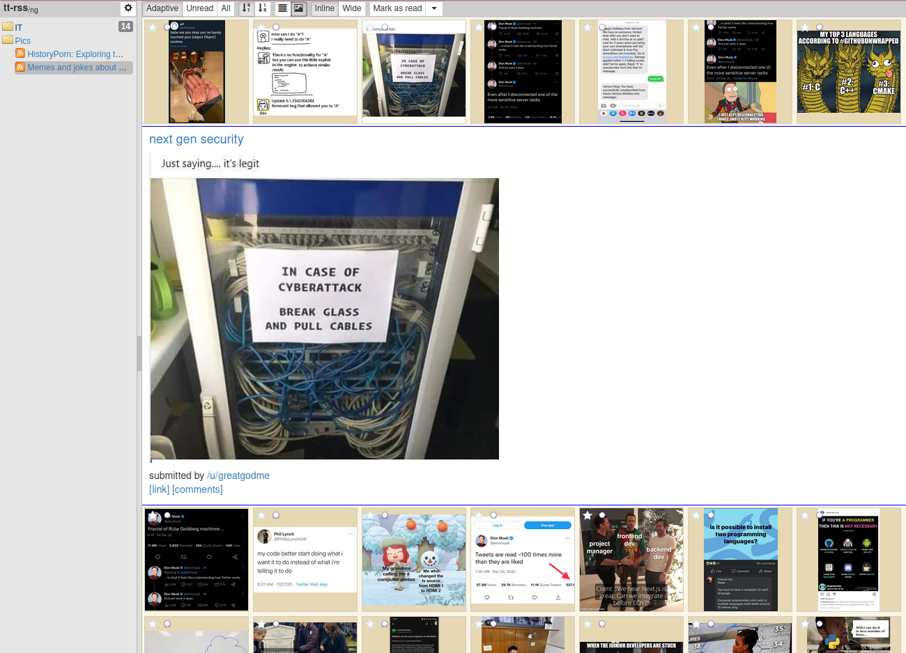

# tt-rss<sub>/ng<sub>
~~NIHS~~ Alternative frontend for [**Tiny Tiny RSS**](https://tt-rss.org/) news feed reader and aggregator.  

## Features
 - 3 available view modes
    - classic inline
    - wide mode
    - thumbnails
 - session settings per feed/group
 - adjustment images for viewport size
 - i18n support
 - speed

 ## Screenshots

 
 
 

 ## Installation

Set .env vars
```
HTTP_PORT=8055
API_PORT=8280
API_HOST="172.17.10.8"
```
Run
```
docker compose -f "docker-compose.yml" up -d --build
```


## License
Distributed under AGPL-3.0.

Some icons by [Yusuke Kamiyamane](http://p.yusukekamiyamane.com/). Licensed under a [Creative Commons Attribution 3.0 License](http://creativecommons.org/licenses/by/3.0/)
